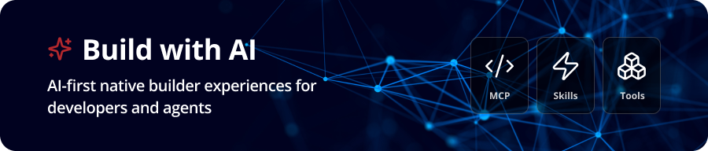

<p align="center">
  
</p>

# Ping Identity Agent Plugins (Skills, MCP, and more)

[](LICENSE)

Ping Identity Agent Plugins give AI coding agents deep knowledge of the Ping Identity platform through a set of purpose-built skills: which product to use, how to configure it, and how to integrate it into your applications. Stop prompt-engineering Ping context and let the skills help you.

> [!NOTE]
> Plugins are being updated periodically. Check back here for updates!

**[Features](#features) | [Install](#install) | [Install Manually](#install-manually) | [MCP Servers](#mcp-servers) | [Skills](#the-6-umbrella-skills) | [Example Prompts](#example-prompts) | [How it works](#how-it-works) | [Contributing](#contributing) | [Feedback](#feedback) | [Related Resources](#related-resources) | [License](#license)**

---

## Features

- **Ping Identity platform expertise** - Skills give AI agents the right context upfront so they can answer questions, generate configurations, and write integrations without guessing.
- **Works with all major AI coding agents** - Claude Code, Cursor, GitHub Copilot, Gemini CLI, and more.
- **MCP server integration** - Installing the plugin in Claude Code or Cursor automatically registers the AIC and DaVinci MCP servers for live tenant access alongside the skills.
- **6 umbrella skills** - Provides assistance with configuring Ping's Identity Platform across tenant setup, authentication orchestration, shared services (risk, KYC, MFA, governance), app integration, and securing your agents.
- **Progressive context loading** - Skills load only what the agent needs for the task at hand, keeping token usage low and responses focused.
- **Composable by design** - Skills work together. A complete solution typically spans 2-3 skills, and `ping-quickstart` routes you to the right combination automatically.

---

## Install

| Agent | Command |
|---|---|
| **Claude Code** | `/plugin marketplace add https://github.com/pingidentity/agent-plugins` |
| **Cursor** | Settings → Plugins → search and add `https://github.com/pingidentity/agent-plugins` |
| **GitHub Copilot** | Clone this repo, then add the relevant `SKILL.md` files to `.github/copilot-instructions.md` in your project |
| **Gemini CLI** | Add to `GEMINI.md`: `plugins: [https://github.com/pingidentity/agent-plugins]` |
| **OpenCode / other** | `npx skills add pingidentity/agent-plugins` (via Skills CLI); see [skills.sh](https://skills.sh) for agent-specific setup |

---

## Install Manually

You can also install using the Skills CLI:

```bash
npx skills add pingidentity/agent-plugins
```

Or install a specific skill:

```bash
npx skills add pingidentity/agent-plugins/plugins/ping-identity/skills/ping-quickstart
npx skills add pingidentity/agent-plugins/plugins/ping-identity/skills/ping-foundation
npx skills add pingidentity/agent-plugins/plugins/ping-identity/skills/ping-orchestration
npx skills add pingidentity/agent-plugins/plugins/ping-identity/skills/ping-universal-services
npx skills add pingidentity/agent-plugins/plugins/ping-identity/skills/ping-app-integration
npx skills add pingidentity/agent-plugins/plugins/ping-identity/skills/ping-identity-for-ai
```

> [!TIP]
> The skills work better together. We recommend installing the entire plugin for the most benefit.

---

## MCP Servers

When you install the plugin in **Claude Code** or **Cursor**, two locally-hosted MCP servers are automatically registered:

| MCP Server | Purpose |
|---|---|
| [**AIC MCP Server**](https://github.com/pingidentity/aic-mcp-server) | Access to PingOne Advanced Identity Cloud (AIC) for journey authoring, tenant administration, and scripted node development, and more. Available in Development and Sandbox environments only. |
| [**DaVinci MCP Server**](https://github.com/pingidentity/davinci-mcp-server) | Access to PingOne DaVinci for read-only access on flow management, application configuration, and more. |

These MCP Servers have variables that must be set to connect to your AIC or PingOne environment. Claude or Cursor will prompt you to enter these.

To add the MCP servers directly without the full plugin, visit the [Build with AI](https://www.pingidentity.com/en/resources/developer/build-with-ai.html) site.

---

## The 6 umbrella skills

| Skill | What it does | Use when... |
|---|---|---|
| `ping-quickstart` | Front door for all Ping Identity work. Identifies which platform you're on, what you're trying to accomplish, and routes you to the right skill | Platform is unknown; "where do I start"; evaluating or comparing Ping products; unsure which product handles your use case |
| `ping-foundation` | Platform setup, administration, and core configuration across PingOne, AIC, PingFederate, PingAccess, PingDirectory, PingGateway, and PingID. Covers environments, app registration, SSO, directories, policies, branding, and deploying PingGateway as an MCP security gateway | Setting up or administering any Ping platform; registering apps; configuring sign-on policies, directories, or custom domains; deploying PingGateway in front of MCP servers |
| `ping-orchestration` | Design and build authentication flows, journeys, and orchestration logic across DaVinci, AIC/PingAM, and PingFederate. Covers login, registration, MFA, passwordless, step-up, progressive profiling, social login, and CIBA | Designing or building any authentication or registration flow; asking "what nodes do I need"; troubleshooting a journey or DaVinci flow |
| `ping-universal-services` | Configure and invoke Ping's shared services: PingOne Protect (risk), PingOne Verify (KYC/identity proofing), PingOne MFA, PingOne Credentials (verifiable credentials), PingOne IGA (governance), and PingOne Authorize (fine-grained authorization) | Adding risk scoring, identity proofing, MFA-as-a-service, verifiable credentials, access governance, or fine-grained authorization to a flow or application |
| `ping-app-integration` | Integrate Ping into web, mobile, and server-side applications. Covers Android, iOS, React, JavaScript SDKs; OIDC/OAuth2 wiring; backend token validation; on-prem agent integration; and SDK troubleshooting | Writing code to connect an app to Ping; embedding a DaVinci flow or AIC journey in a UI; troubleshooting redirect, CORS, or token errors |
| `ping-identity-for-ai` | Secure AI agents and LLM-powered apps with Ping. Covers agent identity registration, machine-to-machine auth, Verified Trust signals, PingGateway as an MCP gateway, CIBA human-in-the-loop approvals, and bot/agent detection | Giving an AI agent a verified identity; securing an MCP server; delegating tokens for a helpdesk AI; applying the Identity for AI 5-pillar architecture |

Skills compose. A complete solution typically spans 2-3 skills. `ping-quickstart` tells you which combination to load.

---

## Example prompts

| # | Prompt | Skill |
|---|---|---|
| 1 | "I'm new to Ping Identity and need to add login to my app. Where do I start?" | ping-quickstart |
| 2 | "What's the difference between PingOne and PingOne Advanced Identity Cloud? Which should I use?" | ping-quickstart |
| 3 | "Help me register an OIDC application in my PingOne environment." | ping-foundation |
| 4 | "How do I add a risk-based step-up MFA challenge to my login flow?" | ping-universal-services |
| 5 | "I need to integrate the Ping JavaScript SDK into my React app to handle a DaVinci flow." | ping-app-integration |
| 6 | "Help me build a passwordless login journey using FIDO2/passkeys in AIC." | ping-orchestration |
| 7 | "What nodes do I need to build a progressive profiling flow that collects a phone number after first login?" | ping-orchestration |
| 8 | "How do I issue a verifiable credential to a user from PingOne Credentials?" | ping-universal-services |
| 9 | "Give my AI agent a client credentials identity so it can call our internal APIs securely." | ping-identity-for-ai |
| 9b | "Deploy PingGateway as an MCP security gateway in front of my existing MCP server on Kubernetes." | ping-foundation |
| 10 | "List all the journeys in my AIC tenant and show me which ones have MFA enabled." | AIC MCP Server |
| 11 | "Create a new login journey in my AIC sandbox that collects username and password, then sends an email OTP." | AIC MCP Server |
| 12 | "Update the branding theme in my AIC tenant to use our company's primary color and logo." | AIC MCP Server |
| 13 | "Show me all the DaVinci flows in my environment and which applications are using them." | DaVinci MCP Server |
| 14 | "List the connectors configured in my DaVinci environment and their current connection status." | DaVinci MCP Server |
| 15 | "Pull the configuration for my main login flow in DaVinci so I can review how the MFA step is set up." | DaVinci MCP Server |

Prompts 10-15 require the plugin to be installed in Claude Code or Cursor with the MCP servers configured.

---

## How it works

Every skill follows a 3-tier progressive disclosure model:

```
Tier 1 - Metadata (~100 tokens)
  skill name + description - loaded at discovery for all skills

Tier 2 - SKILL.md (<5k tokens)
  Routing decision tree: intent -> platform -> reference
  Loaded in full when the skill activates

Tier 3 - References (on demand)
  Files that have the technical detail the agent needs to perform a specified task.
```

The agent stops at the first tier that answers the question. It never loads all anchors at once.

---

## Repo layout

```
plugins/ping-identity/
  skills/
    ping-quickstart/          SKILL.md + references
    ping-foundation/
    ping-orchestration/
    ping-universal-services/
    ping-app-integration/
    ping-identity-for-ai/
  plugin-map.md               skill index and selection rules
  references/index.json       all curated anchor paths
rules/
  authoring-rules.md          frontmatter contract, body length, naming
  routing-rules.md            skill selection precedence
  runtime-selection.md        sandbox-vs-production decision rule
shared/
  taxonomies/                 platform families, capability map, service map
  schemas/                    frontmatter JSON schema
  templates/                  SKILL.md and curated-reference templates
evals/
  prompts/                    trigger / non-trigger / ambiguous prompt sets per skill
  harness/                    Layer 1 + Layer 2 runner, Claude + OpenAI adapters
  results/                    dated eval run outputs
```

---

## Contributing

We welcome contributions! Whether it's a new skill, an improvement to an existing one, or a bug fix, see [CONTRIBUTING.md](CONTRIBUTING.md) for the full guide including skill structure requirements, authoring rules, and how to submit a pull request.

## Eval status

> [!NOTE]
> Our internal testing consistently shows **significant token savings** when the ping-identity skills are loaded compared to a bare baseline, across all six skills and multiple model tiers. Loading a skill gives the agent the right context upfront, so it spends fewer turns exploring, self-correcting, and making incorrect assumptions about Ping APIs.
>
> Full eval results with per-skill and per-model breakdowns are being reviewed and will be published here once finalised.

---

## Feedback

If you have feedback, questions, or want to request a new skill:

- [Open an issue](https://github.com/pingidentity/agent-plugins/issues/new) with the appropriate label (`enhancement`, `bug`, `question`, or `skill-request`)
- Vote on existing issues with thumbs up to help us prioritize

## Related Resources

- [Ping Developer Portal](https://developer.pingidentity.com/)
- [Ping Developer Blog](https://developer.pingidentity.com/blog/)
- [Ping Identity Documentation](https://docs.pingidentity.com/)
- [Build with AI](https://www.pingidentity.com/en/resources/developer/build-with-ai.html)
- [Agent Skills Standard](https://agentskills.io/)
- [Skills CLI](https://skills.sh)

---

## Disclaimer

> **This code is provided by Ping Identity Corporation ("Ping") on an "as is" basis, without
warranty of any kind, to the fullest extent permitted by law.
> Ping Identity Corporation does not represent or warrant or make any guarantee regarding the use of
this code or the accuracy, timeliness or completeness of any data or information relating to this
code, and Ping Identity Corporation hereby disclaims all warranties whether express, or implied or
statutory, including without limitation the implied warranties of merchantability, fitness for a
particular purpose, and any warranty of non-infringement.
> Ping Identity Corporation shall not have any liability arising out of or related to any use,
implementation or configuration of this code, including but not limited to use for any commercial
purpose.
> Any action or suit relating to the use of the code may be brought only in the courts of a
jurisdiction wherein Ping Identity Corporation resides or in which Ping Identity Corporation
conducts its primary business, and under the laws of that jurisdiction excluding its conflict-of-law
provisions.**

## License

This software may be modified and distributed under the terms of the MIT license. See the [LICENSE](./LICENSE) file for details

© Copyright 2026 Ping Identity Corporation. All rights reserved.
